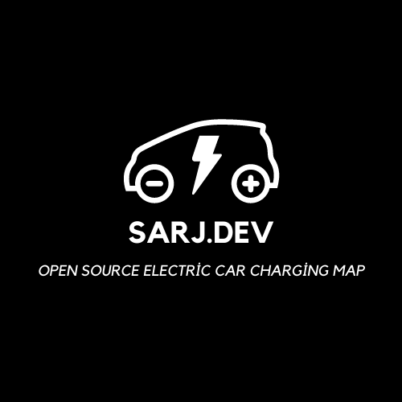

# Sarj.dev - Electric Vehicle Charging Station Map App (Back-End)

  

🌿 Welcome to **[sarj.dev](https://sarj.dev/)**! This open-source project provides a back-end solution for an interactive map application focused on Electric Vehicle (EV) charging stations across Turkey. Developed using Java, the Spring Framework, and Elasticsearch, this project empowers EV owners to find, track, and plan their charging needs seamlessly.

## Project Overview

[sarj.dev](https://sarj.dev/) aims to enhance the electric vehicle charging experience in Turkey by offering a comprehensive map application that includes real-time charging station data, search functionalities, and nearby station recommendations.

## Features

- 🗺️ **Interactive Map:** Visualize electric vehicle charging stations on an interactive map.
- ⚡ **Real-time Data:** Access up-to-date information about each charging station, including socket availability, power capacity, and pricing details.
- 🔍 **Advanced Search:** Utilize the search feature to find charging stations based on specific criteria.
- 📍 **Nearby Stations:** Get a list of charging stations near your location for convenient access.
- 🔗 **Search Suggestions:** Receive search suggestions for quicker station discovery.

## Prerequisites

- Java 17 or higher
- Spring Framework (e.g., Spring Boot)
- Elasticsearch
- Docker (for containerization)

## Installation

1. Clone the project: `git clone https://github.com/sarjdev/back-end.git`
2. Install required dependencies using your preferred build tool (Maven).
3. Configure Elasticsearch: (see `compose file`)
4. Start the application: Run `mvn spring-boot:run` in the project root.

## Docker Compose (Optional)

To run the application using Docker Compose, follow these steps:

1. Install Docker on your machine.
2. In the project root, make sure you have a `docker-compose.yml` file.
3. Run `docker-compose up` to start the application and Elasticsearch.

## Usage

1. Once the application is up and running, access it through your browser at `http://localhost:8080` or your custom domain.
2. Explore the map to view charging stations. Click on a station to reveal more information.
3. Use the search bar to filter stations based on specific attributes.
4. To view nearby charging stations, you might need to grant location permission.

## How to Contribute

- Create a new branch for your feature: `git checkout -b feature/your-feature`
- Make your changes and stage them using `git add`.
- Commit your changes with a meaningful message: `git commit -m "Add your message here"`.
- Push your branch to your forked repository: `git push origin feature/your-feature`.
- Create a pull request in the original repository and await review.

## License

This project is licensed under the [GNU General Public License v3.0](https://github.com/sarjdev/back-end/blob/master/LICENSE)

## Acknowledgements

We would like to express our gratitude to the contributors of this project and the open-source community for their valuable contributions and support.

## Get in Touch

For questions, suggestions, or collaborations, please contact us at [hi@sarj.dev](mailto:hi@sarj.dev) or visit our website at [https://sarj.dev](https://sarj.dev).

🚀 Let's contribute to a greener future together! 🌍

---
